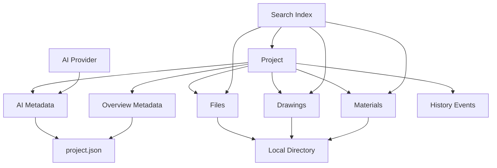
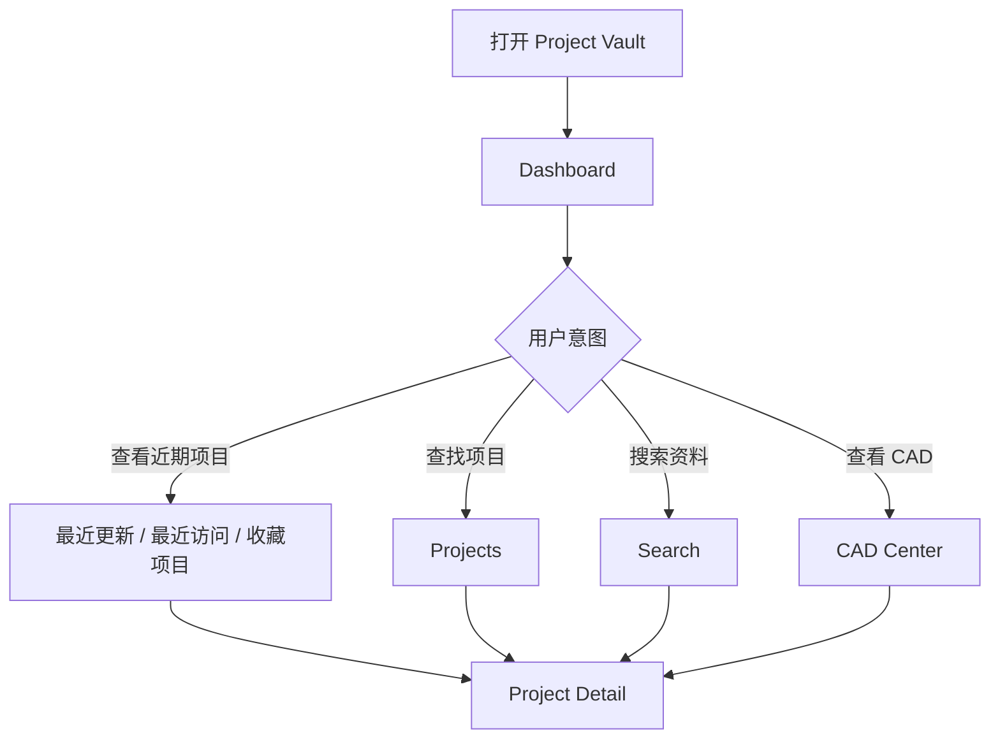
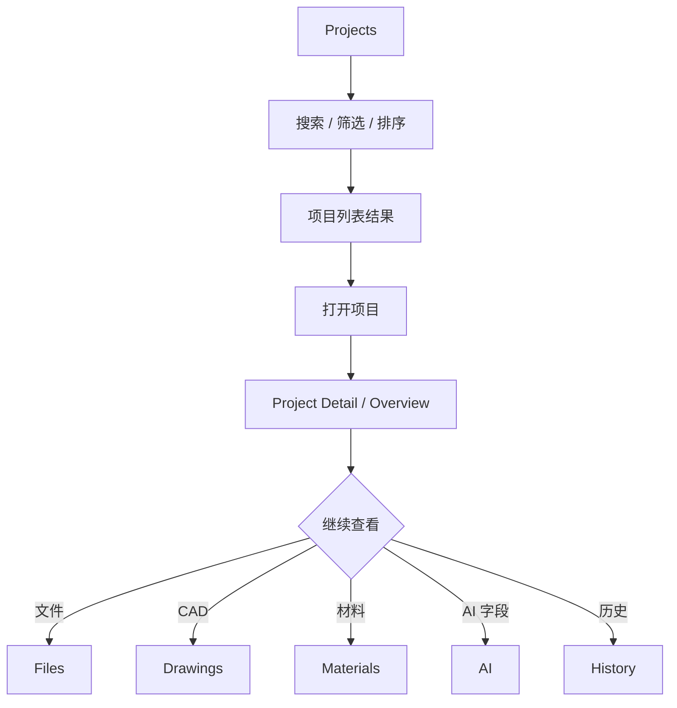
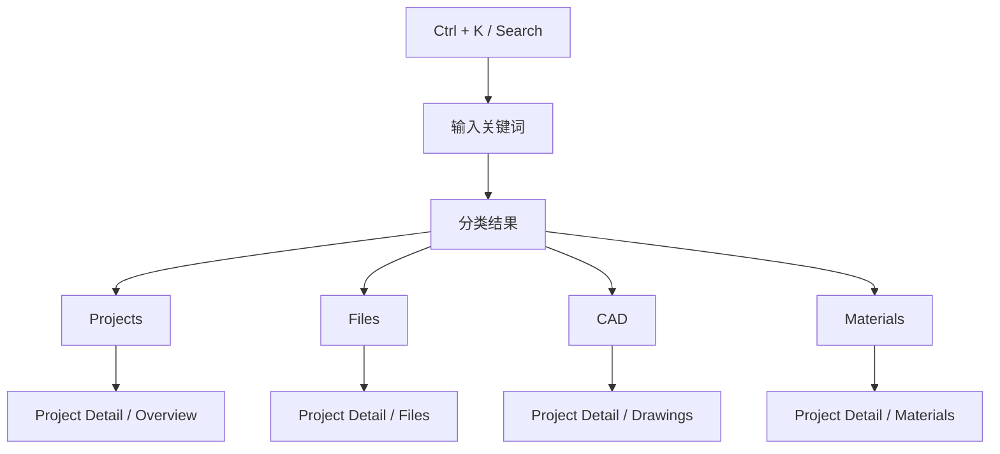
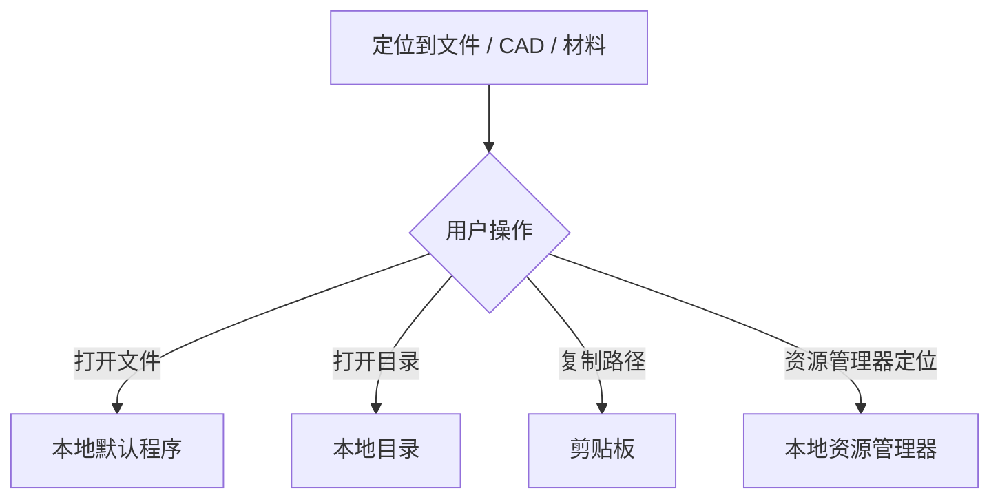
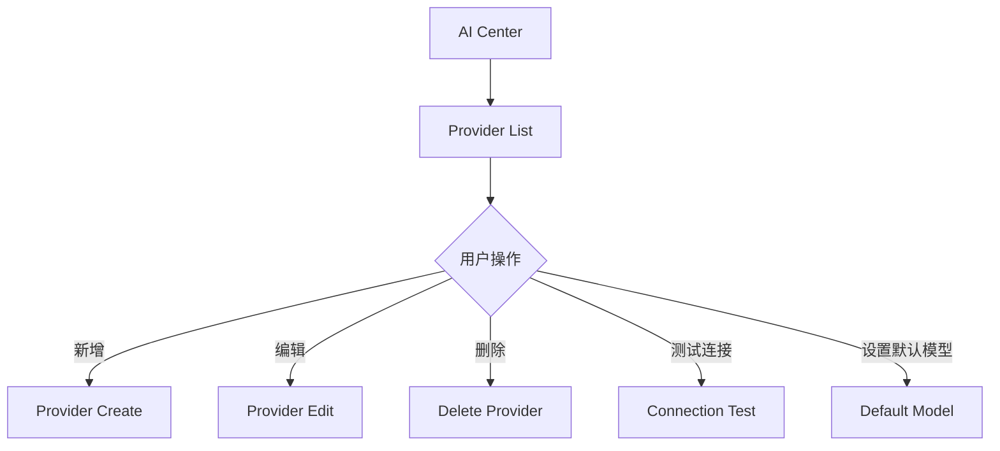
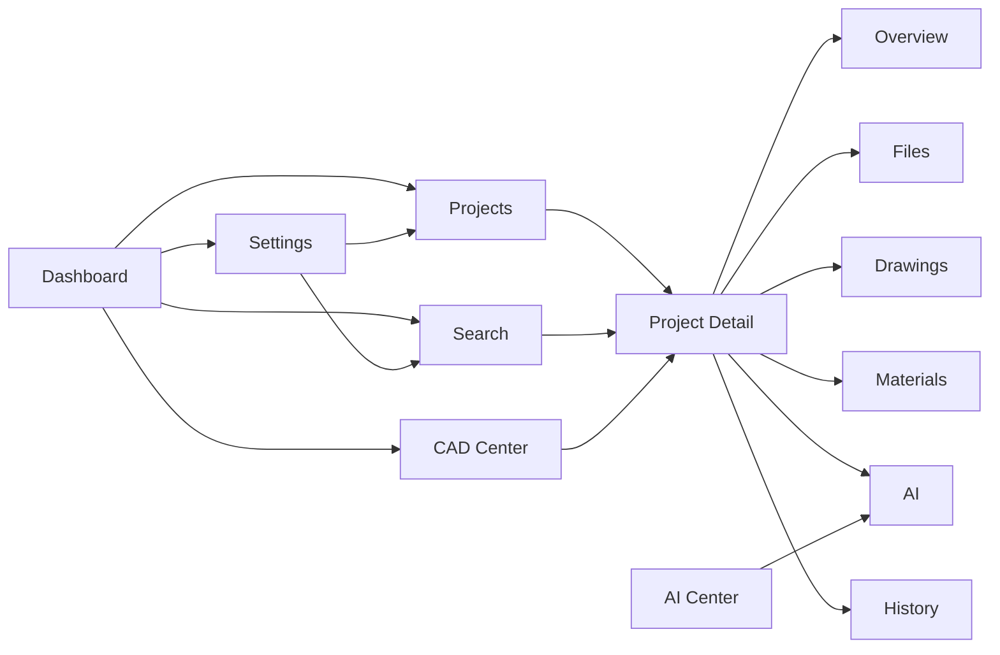
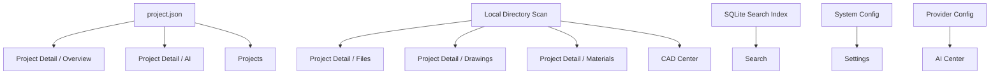

# Project Vault V1.0 Information Architecture

版本：V1.0

状态：IA Draft

日期：2026-06-24

依据文档：《Project Vault V1.0 产品需求文档（PRD）》

---

# 1. 信息架构目标

Project Vault V1.0 的信息架构围绕“项目”这一核心对象组织，目标是让用户能够快速定位任意项目、任意文件、任意 CAD 图纸、任意材料资料和任意历史版本线索。

V1 不替代资源管理器、网盘、OA 或协同系统，而是作为本地项目资料的索引、检索、浏览和沉淀入口。

---

# 2. 核心对象模型

## 2.1 一级核心对象

| 对象 | 说明 | 主要来源 |
|---|---|---|
| Project | 系统中的第一核心对象，承载所有资料组织关系 | project.json、本地项目目录 |
| File | 项目内的普通文件与目录资源 | 本地目录扫描 |
| Drawing | CAD 图纸资源，是 File 的专业化分类 | 本地目录扫描、文件识别 |
| Material | 材料相关资料，是 File 的专业化分类 | 本地目录扫描、文件识别 |
| AI Metadata | 项目的 AI 摘要、标签、需求、风险等结构化字段 | project.json |
| Provider | AI 模型服务提供商配置 | 本地配置、安全凭据 |
| Search Index | 全局检索索引 | SQLite / SQLite FTS |
| History Event | 项目创建、扫描、文件更新、AI 分析等时间线事件 | 本地记录、扫描记录 |

## 2.2 对象关系



---

# 3. 页面层级结构

## 3.1 全局页面树

```text
Project Vault
├── Dashboard
├── Projects
│   ├── Project List
│   ├── Project Card View
│   ├── Project Table View
│   └── Project Detail
│       ├── Overview
│       ├── Files
│       ├── Drawings
│       ├── Materials
│       ├── AI
│       └── History
├── Search
│   ├── Search Input
│   ├── Project Results
│   ├── File Results
│   ├── CAD Results
│   └── Material Results
├── CAD Center
│   ├── All CAD Drawings
│   ├── Recently Updated CAD
│   ├── CAD Category Statistics
│   └── CAD Version Tracking
├── AI Center
│   ├── Provider List
│   ├── Provider Detail
│   ├── Provider Create
│   ├── Provider Edit
│   └── Connection Test
└── Settings
    ├── System Settings
    ├── Project Root Settings
    ├── Auto Scan Settings
    ├── Cache Management
    ├── Log Management
    ├── Backup Management
    └── Appearance Settings
```

## 3.2 主导航层级

| 导航项 | 层级 | 作用 | 备注 |
|---|---:|---|---|
| Dashboard | 一级 | 系统概览和近期入口 | 默认首页 |
| Projects | 一级 | 项目管理与项目列表 | 核心工作区 |
| Search | 一级 | 全局统一检索 | 支持 Ctrl + K |
| CAD Center | 一级 | 跨项目 CAD 汇总与追踪 | V1 独立模块 |
| AI Center | 一级 | AI Provider 管理 | V1 只做配置 |
| Settings | 一级 | 系统、扫描、缓存、日志、备份、界面设置 | 管理入口 |

## 3.3 Project Detail 二级结构

| Tab | 信息范围 | 用户目的 |
|---|---|---|
| Overview | 项目基本信息、统计、简介、标签 | 快速理解项目状态 |
| Files | 标准目录结构和所有项目文件 | 浏览、打开、定位文件 |
| Drawings | CAD 分类、版本、更新时间线 | 快速管理图纸资料 |
| Materials | PDF、图片、Excel、Word 等材料资料 | 查看项目材料沉淀 |
| AI | AI 摘要、标签、需求、风险、经验总结 | 查看结构化知识字段 |
| History | 创建、扫描、文件更新、AI 分析记录 | 追踪项目资料变化 |

---

# 4. 页面信息结构

## 4.1 Dashboard

### 页面定位

Dashboard 是系统默认入口，用于提供全局状态、近期项目和高频访问入口。

### 主要信息区

| 信息区 | 内容 |
|---|---|
| 系统统计 | 项目总数、CAD 图纸总数、材料资料总数 |
| 最近更新项目 | 最近发生文件或元数据变化的项目 |
| 最近访问项目 | 用户近期打开过的项目 |
| 收藏项目 | 用户主动收藏的高频项目 |
| 快捷入口 | 进入项目列表、全局搜索、CAD Center、Settings |

### 主要跳转

| 用户动作 | 目标页面 |
|---|---|
| 点击项目 | Project Detail / Overview |
| 点击最近更新项目 | Project Detail / History 或 Overview |
| 点击 CAD 统计 | CAD Center |
| 点击搜索入口 | Search |

---

## 4.2 Projects

### 页面定位

Projects 是项目管理主入口，负责展示、筛选、排序和打开项目。

### 页面结构

| 信息区 | 内容 |
|---|---|
| 项目检索 | 按项目名称、项目 ID、标签、摘要等检索 |
| 筛选条件 | 项目类型、项目阶段、收藏状态、更新时间 |
| 排序方式 | 最近更新、创建时间、项目名称、文件数量 |
| 视图切换 | 列表视图、卡片视图 |
| 项目结果区 | 项目卡片或项目表格 |

### 项目卡片 / 列表字段

| 字段 | 说明 |
|---|---|
| 项目名称 | 项目主要识别信息 |
| 项目类型 | 如室内设计、SI 设计等 |
| 项目阶段 | 当前项目所处阶段 |
| 最后更新时间 | 最近扫描或文件更新时间 |
| 文件总数 | 项目内文件总量 |
| CAD 数量 | 项目内 CAD 图纸数量 |
| 材料数量 | 项目内材料资料数量 |
| AI 摘要 | V1 预留展示字段 |
| 收藏状态 | 用户标记的高频项目 |

### 主要跳转

| 用户动作 | 目标页面 |
|---|---|
| 点击项目名称或卡片 | Project Detail / Overview |
| 点击 CAD 数量 | Project Detail / Drawings |
| 点击材料数量 | Project Detail / Materials |
| 点击快速打开 | 本地文件或目录 |
| 使用搜索 | 当前 Projects 结果过滤 |

---

## 4.3 Project Detail

### 页面定位

Project Detail 是单个项目的资料中枢，所有信息均围绕当前项目组织。

### 固定结构

```text
Project Detail
├── Project Header
│   ├── Project Name
│   ├── Project ID
│   ├── Project Type
│   ├── Project Stage
│   ├── Last Updated Time
│   └── Primary Actions
└── Tabs
    ├── Overview
    ├── Files
    ├── Drawings
    ├── Materials
    ├── AI
    └── History
```

### Overview

| 信息区 | 内容 |
|---|---|
| 基本信息 | 项目名称、项目 ID、项目类型、项目阶段、负责人 |
| 时间信息 | 创建时间、更新时间 |
| 项目简介 | 项目说明和背景 |
| 项目标签 | 结构化标签 |
| 统计信息 | 文件数、CAD 数、材料数、更新时间 |

### Files

| 标准目录 | 说明 |
|---|---|
| 01_项目前期资料 | 前期沟通、现场、立项相关资料 |
| 02_需求资料 | 需求文档、客户资料、输入信息 |
| 03_CAD图纸 | CAD 图纸文件 |
| 04_效果图 | 效果图和视觉相关文件 |
| 05_汇报文件 | 汇报、提案、演示资料 |
| 06_材料资料 | 材料表、材料图片、供应信息 |
| 07_现场资料 | 现场照片、测量、施工相关资料 |

| 操作 | 说明 |
|---|---|
| 打开文件 | 调用本地默认程序 |
| 打开目录 | 打开文件所在目录 |
| 复制路径 | 复制本地路径 |
| 资源管理器定位 | 在本地资源管理器中定位 |

### Drawings

| 分类 | 说明 |
|---|---|
| 平面图 | 平面布局相关 CAD |
| 立面图 | 立面相关 CAD |
| 天花图 | 天花、灯位、吊顶相关 CAD |
| 节点图 | 节点和详图 |
| 施工图 | 施工交付相关图纸 |
| 其他 | 无法自动归类或杂项 CAD |

| 信息区 | 内容 |
|---|---|
| CAD 统计 | 当前项目图纸数量和分类数量 |
| CAD 版本链 | 同名或相关图纸的版本关系 |
| CAD 更新时间线 | 图纸更新顺序和时间 |
| CAD 快速打开 | 打开图纸或定位文件 |

### Materials

| 信息区 | 内容 |
|---|---|
| 材料文件列表 | PDF、图片、Excel、Word 等 |
| 材料分类 | 按文件类型或目录来源分组 |
| 材料检索 | 当前项目内材料资料检索 |
| 文件操作 | 打开、定位、复制路径 |

V1 不做跨项目材料库，仅展示当前项目材料资料。

### AI

| 字段 | 说明 |
|---|---|
| AI 摘要 | 项目的结构化摘要 |
| 项目标签 | AI 或人工维护的标签 |
| 核心需求 | 项目关键需求点 |
| 特殊要求 | 客户或场地特殊约束 |
| 风险提示 | 项目风险点 |
| 经验总结 | 项目复盘与知识沉淀 |

V1 只展示字段，不提供 AI 生成、聊天、Agent 或 RAG 功能。

### History

| 事件类型 | 说明 |
|---|---|
| 项目创建 | 项目首次进入系统 |
| 项目扫描 | 本地目录扫描记录 |
| 文件更新 | 文件新增、修改或删除记录 |
| AI 分析记录 | AI 字段更新或分析记录 |

---

## 4.4 Search

### 页面定位

Search 是全局统一检索入口，用于跨项目查找项目、文件、CAD、材料和 AI 字段。

### 检索范围

| 范围 | 字段 |
|---|---|
| Project | 项目名称、项目 ID、项目标签、AI 摘要 |
| File | 文件名称、文件路径、目录名称 |
| CAD | CAD 名称、CAD 分类、更新时间 |
| Material | 材料名称、文件类型、目录来源 |
| AI Metadata | 摘要、标签、核心需求、特殊要求、风险提示、经验总结 |

### 结果分类

```text
Search Results
├── Projects
├── Files
├── CAD
└── Materials
```

### 主要跳转

| 用户动作 | 目标页面 |
|---|---|
| 点击项目结果 | Project Detail / Overview |
| 点击文件结果 | Project Detail / Files，并定位文件 |
| 点击 CAD 结果 | Project Detail / Drawings，并定位图纸 |
| 点击材料结果 | Project Detail / Materials，并定位资料 |
| 快速打开结果 | 本地文件或目录 |

---

## 4.5 CAD Center

### 页面定位

CAD Center 是跨项目 CAD 图纸汇总入口，用于快速查找、统计和追踪图纸。

### 页面结构

| 信息区 | 内容 |
|---|---|
| 所有 CAD 汇总 | 跨项目 CAD 列表 |
| 最近更新 CAD | 最近发生变化的 CAD 文件 |
| CAD 分类统计 | 平面图、立面图、天花图、节点图、施工图、其他 |
| CAD 版本追踪 | 同项目内 CAD 版本链 |

### 主要跳转

| 用户动作 | 目标页面 |
|---|---|
| 点击项目 | Project Detail / Overview |
| 点击 CAD | Project Detail / Drawings，并定位图纸 |
| 快速打开图纸 | 本地 CAD 文件 |

---

## 4.6 AI Center

### 页面定位

AI Center 仅负责 AI Provider 管理，不承载 AI 聊天、Agent、RAG 或内容生成工作流。

### Provider 信息结构

| 字段 | 说明 |
|---|---|
| 名称 | Provider 展示名称 |
| Base URL | 服务接口地址 |
| API Key | 安全凭据，不明文存储 |
| 默认模型 | 当前 Provider 默认模型 |
| 启用状态 | 是否可用 |

### 页面结构

```text
AI Center
├── Provider List
├── Provider Create
├── Provider Edit
├── Provider Detail
└── Connection Test
```

### 支持 Provider

| Provider | 说明 |
|---|---|
| OpenAI | 官方 OpenAI 服务 |
| OpenRouter | 多模型聚合服务 |
| Anthropic | Claude 系列模型服务 |
| Google Gemini | Gemini 系列模型服务 |
| Custom(OpenAI Compatible) | OpenAI 兼容接口 |

---

## 4.7 Settings

### 页面定位

Settings 是系统配置和维护入口，承载项目根目录、扫描、缓存、日志、备份和界面设置。

### 页面结构

| 设置项 | 内容 |
|---|---|
| 项目根目录 | 当前系统扫描的项目根路径 |
| 自动扫描开关 | 是否启用自动扫描 |
| 扫描周期 | 自动扫描间隔 |
| 缓存管理 | 清理或重建缓存 |
| 日志管理 | 查看和清理系统日志 |
| 备份管理 | 备份系统配置和索引 |
| 界面设置 | 深色模式、浅色模式预留 |

---

# 5. 用户导航流程

## 5.1 默认进入流程



## 5.2 查找项目流程



## 5.3 全局搜索流程



## 5.4 打开资料流程



## 5.5 AI Provider 管理流程



---

# 6. 页面关系图

## 6.1 全局页面关系



## 6.2 内容到页面映射



---

# 7. V1 边界

## 7.1 V1 包含

| 模块 | 包含能力 |
|---|---|
| Dashboard | 系统概览、近期项目、收藏项目 |
| Projects | 项目列表、搜索、排序、筛选、收藏、快速打开 |
| Project Detail | Overview、Files、Drawings、Materials、AI、History |
| Search | 全局项目、文件、CAD、材料检索 |
| CAD Center | 跨项目 CAD 汇总、分类统计、版本追踪 |
| AI Center | AI Provider 新增、编辑、删除、测试连接、默认模型 |
| Settings | 项目根目录、扫描、缓存、日志、备份、界面设置 |

## 7.2 V1 不包含

| 能力 | 处理方式 |
|---|---|
| OA | 不进入 V1 信息架构 |
| 审批流程 | 仅 V2+ 预留 |
| 任务管理 | 仅 V2+ 预留 |
| 甘特图 | 仅 V2+ 预留 |
| 在线 CAD 查看 | 仅 V2+ 预留 |
| 在线编辑文件 | 仅 V2+ 预留 |
| AI 聊天 | 仅 V2+ 预留 |
| Agent | 仅 V2+ 预留 |
| RAG 知识库 | 仅 V2+ 预留 |
| 多人协同 | 仅 V2+ 预留 |
| 权限系统 | 仅 V2+ 预留 |
| 云同步 | 仅 V2+ 预留 |

---

# 8. 未来 V2 扩展预留

## 8.1 导航预留

V1 主导航保持克制，V2 可在不破坏现有结构的前提下扩展以下一级或二级入口。

| V2 模块 | 建议位置 | 与 V1 的关系 |
|---|---|---|
| Tasks | 一级导航或 Project Detail Tab | 从项目派生任务 |
| Approval | 一级导航或 Project Detail Tab | 面向审批流 |
| Timeline / Gantt | Project Detail Tab | 从 History 扩展 |
| Online CAD Viewer | Project Detail / Drawings 子页面 | 从 CAD 快速打开升级 |
| AI Workspace | AI Center 下新增 | 从 Provider 管理升级为 AI 工作区 |
| Knowledge Base / RAG | 一级导航或 AI Center 子模块 | 从 AI Metadata 扩展 |
| Team / Permission | Settings 子模块 | 多用户与权限控制 |
| Cloud Sync | Settings 子模块 | 本地资料同步与备份 |
| Material Library | 一级导航或 Materials 子模块 | 从项目内材料扩展为跨项目材料库 |

## 8.2 Project Detail Tab 预留

```text
Project Detail
├── Overview
├── Files
├── Drawings
├── Materials
├── AI
├── History
├── Tasks                # V2 reserved
├── Approval             # V2 reserved
├── Timeline / Gantt     # V2 reserved
└── Collaboration        # V2 reserved
```

## 8.3 数据对象预留

| 对象 | V2 扩展方向 |
|---|---|
| Project | 增加成员、权限、状态流转、任务统计 |
| File | 增加在线预览、版本 diff、评论 |
| Drawing | 增加在线 CAD 查看、标注、图纸对比 |
| Material | 增加跨项目材料库、品牌、供应商、价格字段 |
| AI Metadata | 增加生成记录、提示词、引用来源、置信度 |
| History Event | 扩展为完整审计日志 |
| Provider | 增加模型能力标签、用量统计、费用估算 |
| Search Index | 增加语义检索、向量索引、RAG 引用 |

## 8.4 URL / 路由预留建议

| V1 路由 | V2 可扩展子路由 |
|---|---|
| `/projects/:id` | `/projects/:id/tasks` |
| `/projects/:id/drawings` | `/projects/:id/drawings/:drawingId/viewer` |
| `/projects/:id/materials` | `/materials/library` |
| `/projects/:id/ai` | `/projects/:id/ai/runs` |
| `/ai` | `/ai/workspace`、`/ai/knowledge-base` |
| `/settings` | `/settings/team`、`/settings/permissions`、`/settings/sync` |

## 8.5 V2 扩展原则

1. 不改变“项目是第一核心对象”的信息架构原则。
2. 新模块应优先从 Project Detail 的 Tab 或现有中心模块扩展。
3. 跨项目能力必须保留回到单个 Project Detail 的路径。
4. AI 能力扩展时，需要区分 Provider 管理、AI 生成、AI 检索和 Agent 自动化。
5. 协同、权限、云同步进入 V2 后，应统一归入账户与系统治理层，不污染 V1 的本地资料管理心智。

---

# 9. IA 总结

Project Vault V1.0 的信息架构采用“全局概览 + 项目列表 + 项目详情 + 专项中心 + 系统设置”的结构。

用户可以从 Dashboard 快速回到近期项目，也可以通过 Projects 按项目组织浏览，通过 Search 跨项目定位任意资料，通过 CAD Center 专门处理图纸，通过 AI Center 管理模型服务配置。

V1 的架构重点是稳定、清晰和高密度检索；V2 的扩展重点应围绕协同、任务、审批、在线预览、AI 生成和知识库逐步展开。
